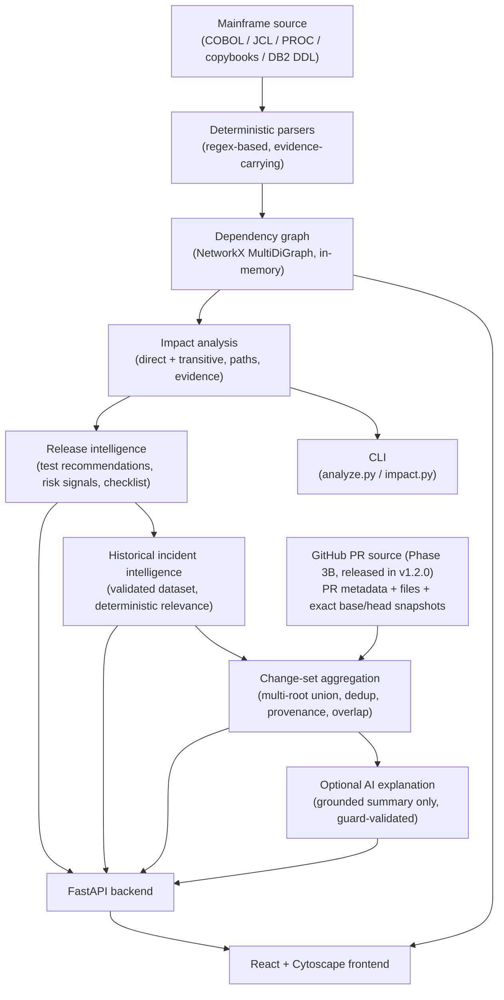

# Mainframe Change Impact & Release Intelligence

> **Deterministic-first design:** LLMs do not discover dependencies, calculate technical impact,
> select regression tests, create risk signals, select incidents, or modify verified deterministic
> results. AI is optional and is restricted to grounded explanation.

Answer *"what does changing this mainframe component affect?"* — from dependency discovery
through release readiness — with **verified, evidence-backed, deterministic analysis** and
historical incident intelligence.

## What it is

A full-stack platform that scans mainframe source (COBOL, copybooks, JCL, PROCs, DB2 DDL),
builds an evidence-carrying dependency graph, and answers change-impact questions:

- Which programs, jobs, and procedures depend on the changed component (directly and transitively)?
- Which DB2 tables are *involved* (read/written by impacted programs) — kept strictly distinct from *impacted* components?
- Which regression tests must run, and why (deterministic rule, with rationale and evidence per test)?
- What release risks does the change carry, and what should the release checklist cover?
- Which past incidents are deterministically related to this change — with historical severity kept separate from change relevance?
- Optionally: a grounded plain-language explanation of all of the above.

Three interfaces serve the same deterministic engine: a **CLI**, a **FastAPI backend**, and a
**React + Cytoscape frontend** with an interactive dependency graph and a Release Intelligence view.

## Why it exists

Mainframe estates are large, old, and poorly documented. A one-line change to a copybook can ripple
through batch jobs and DB2 writes in ways no one can hold in their head — and "just ask the LLM"
is not an acceptable analysis strategy for production releases, because LLMs invent facts.

### Problem statement

Change-impact analysis for mainframe systems must be **trustworthy**: every claimed relationship
must be traceable to a real source statement, and no step of the analysis may hallucinate. At the
same time, release teams need *actionable* output — test selection, risk signals, checklists,
historical precedent — not a raw edge list. This project proves both can coexist: a
deterministic core that never guesses, with an optional AI layer that is architecturally
incapable of altering the core's results.

## What's new in v1.1

v1.1 extends the deterministic engine from single-component changes to complete
multi-file release/change sets:

- **Multi-file change-set analysis** — analyse a whole release candidate, not just one changed component
- **Deterministic file → component mapping** — every changed file is mapped by the parsers, never by AI; ambiguous and unmapped files are reported honestly
- **Changed vs downstream-impacted separation** — changed roots are never listed as downstream impact
- **Cross-impact between changed components** — one changed root impacting another is shown explicitly
- **Root-by-root impact provenance** — every aggregate cites which changed root it came from
- **Base/head snapshot provenance** — deleted files are analysed on base, everything else on head; mixed snapshots are flagged
- **Added / modified / deleted / renamed Git changes** — rename-aware old/base and new/head semantics
- **Local Git diff analysis** — the CLI reads a Git range directly; the HTTP API accepts explicit file lists only and never takes repository paths
- **Deduplicated regression-test recommendations** — strongest priority (`MUST_RUN` > `SHOULD_RUN`) wins per test, reasons preserved
- **Release-level DB2/resource intelligence** — `READ` and `WRITE` kept independent
- **Aggregated risks / checklist / incidents** — deterministic merge of per-root release intelligence
- **Release / Change Set UI** — sixth frontend view with changed/downstream separation, overlap, provenance, and ambiguity views

The deterministic-first principle is unchanged: AI may only explain verified results, never determine them.

## What's new in v1.2

v1.2 extends the deterministic change-set engine to actual **GitHub Pull Requests**.
GitHub acts only as the source of the change set; Phase 3A remains the single
deterministic analysis engine:

- **Read-only GitHub Pull Request analysis** — no GitHub writes, comments, or check runs
- **PR changed-file discovery** — paginated GitHub REST integration (public repos; optional server-side token for private repos)
- **Exact base/head SHA snapshot analysis** — snapshots are pinned to the full immutable commit SHAs, never branch names or current HEAD
- **Same-repository and fork PR handling** — including deleted forks (exact head SHA retrieved from the base repo)
- **Added / modified / deleted / renamed file support** — rename-aware semantics with original GitHub rename provenance preserved
- **Source-root scoping** — files outside the source root never contaminate Mainframe intelligence
- **GitHub-to-Phase-3A deterministic adapter** — a read-only provider feeds the frozen Phase 3A `ChangeSetAnalyzer`; no GitHub-specific impact engine exists
- **GitHub-specific provenance** — repository, PR number, SHAs, file-level mapping status, and rate-limit state recorded alongside every analysis
- **PR pagination with >3000-file fail-closed behavior** — partial file lists are never analyzed
- **Secure repository snapshot materialization** — archive traversal protection, symlink/hardlink/special-file rejection, and enforced download/per-file/extracted-size/file-count limits
- **Credential-safe archive redirects** — the token never reaches the archive request; userinfo, trailing-dot, and non-default-port redirect targets are rejected
- **GitHub rate-limit handling** — primary, secondary, and 429 limits map to typed `github_rate_limited`; retries are bounded to transient 5xx and network/timeout failures
- **GitHub PR CLI** (`github_pr.py`) — server-side token only, no `--token` flag
- **GitHub PR API** (`POST /api/github/pull-request/analyze`, `GET /api/github/status`)
- **Seventh GitHub PR UI** — PR analysis view with provenance, mapping status, and deterministic results

GitHub identifies the change set.
GitHub does not calculate impact.
AI does not calculate impact.
Phase 3A remains authoritative.

## Capabilities

| Capability | How |
|---|---|
| **Deterministic dependency discovery** | Regex-based COBOL/JCL/DB2 parsers extract relationships; every dependency cites file, line, and exact source statement |
| **Change impact analysis** | Direct + transitive dependents via reverse graph traversal, with dependency paths and per-edge evidence |
| **Involved DB2 resources** | Tables read/written by impacted programs, derived from deterministic graph edges — explicitly "involved, not impacted" |
| **Regression test recommendation** | Deterministic rule: a test is recommended iff its coverage intersects the impact set; `MUST_RUN` / `SHOULD_RUN` levels with generated rationale and evidence |
| **Release risk signals** | 8 deterministic rules (e.g. `DB2_WRITE_INVOLVED` — the only `high` severity) with reasons and evidence |
| **Release checklist** | 7 deterministic items per change scenario, each citing its triggering rule |
| **Historical incident intelligence** | 17 synthetic incidents, deterministically matched by 5 reason types; severity separate from relevance |
| **Change-set / release analysis** | Multi-root aggregation of the frozen layers: deduped impact union, overlap detection, strongest-priority test merge, per-root provenance, honest uncertainty on ambiguous/unmapped/deleted files |
| **GitHub PR analysis (Phase 3B, released in v1.2.0)** | Read-only change-source adapter: PR metadata + changed files + exact base/head SHA snapshots feed the frozen Phase 3A engine — GitHub never determines impact |
| **Grounded AI explanation (optional)** | An LLM may *summarise* the deterministic results; output is guard-validated and can never alter them |
| **Interactive dependency graph** | Cytoscape graph with parallel-edge separation, Fit/Reset view, clickable evidence panel |
| **Negative control** | `copybook:UNUSED` demonstrates the engine reporting a clean zero-result instead of inventing relationships |

## Architecture



**Data-flow narrative** (see `docs/PROCESS_FLOW.md` for the full version):

1. `repository_scanner` walks `sample_mainframe/`, dispatching per file type to the COBOL, JCL, PROC, and SQL parsers.
2. Parsers emit components (18) and dependencies (30); each dependency carries mandatory evidence `{file, line, text}`.
3. The `DependencyGraph` (NetworkX `MultiDiGraph`) stores edges in **"depends on"** direction, preserving parallel edges (e.g. a program that both reads and writes a table).
4. `ImpactAnalyzer` traverses the **reversed** graph: dependents of the changed component are impacted (direct = distance 1, transitive = distance ≥ 2), producing shortest dependency paths with per-edge evidence.
5. `build_impact_context` + deterministic rules produce test recommendations, risk signals, and checklist items.
6. The incident relevance engine matches the validated 17-incident dataset against the impact context using 5 deterministic reason types.
7. Optionally, the AI layer serialises the deterministic results into a strict context, generates a four-section explanation, and the hallucination guard validates every identifier before the text can reach a user.
8. Change-set analysis (`changeset.py`, `POST /api/change-set/analyze`, the Release / Change Set view) maps a set of changed files to components and runs steps 4–7 per changed component, then aggregates the results at the release level: explicit changed components (kept disjoint from downstream impact, with cross-impact between changed roots shown, never hidden), deduplicated downstream impact union with per-root snapshot provenance, overlap detection, strongest-priority test merge, merged DB2 resources (READ/WRITE independent), merged signals/checklist with order-invariant regenerated prose, and merged incidents. See `docs/CHANGE_SET_ANALYSIS.md`.

Phase 3B (released in v1.2.0, merged into main) adds a read-only
GitHub PR change-source adapter feeding the same engine: PR metadata, the
paginated changed-file list, and exact base/head SHA snapshots are fetched from
GitHub, while all component mapping, impact, tests, risks, checklists, and
incidents are determined by the frozen Phase 3A engine. GitHub never determines
impact. See `docs/GITHUB_PR_ANALYSIS.md`.

## The deterministic principle (read this first)

```
LLMs do not discover dependencies, calculate technical impact,
select regression tests, create risk signals, select incidents,
or modify verified deterministic results.

AI is optional and is restricted to grounded explanation.
```

The AI layer receives a **one-way serialised context of already-computed deterministic results** —
no repository paths, no raw source, no graph access. Its output is mechanically validated by a
hallucination guard (subject check + identifier-vocabulary check) and the UI badge is set
authoritatively by the service (`DETERMINISTIC SUMMARY` vs `AI EXPLANATION`), never parsed from
the text. On any failure — network error, bad key, guard rejection — the system falls back to
the deterministic provider. Full contract in `docs/AI_GROUNDING.md`.

## Example: change to `copybook:WARRCOPY`

The canonical demo scenario. Change the shared warranty copybook and the engine reports:

| Result | Value |
|---|---|
| Direct impacts | 2 — `program:WARR001`, `program:WARR002` |
| Transitive impacts | 3 — `job:DAILY01`, `job:WARRBTCH`, `proc:WARRANTY` |
| Dependency paths | 6 (shortest impact chains, each with per-edge evidence) |
| Recommended tests | 7 (6 `MUST_RUN`, 1 `SHOULD_RUN`) with rationale + evidence, e.g. `cobol/WARR001.cbl:15` — `COPY WARRCOPY.` |
| Risk signals | 7, including `DB2_WRITE_INVOLVED` (high) and `SHARED_COPYBOOK_CHANGE` |
| Release checklist | 7 items, each citing its triggering rule |
| Relevant historical incidents | 11 of 17, each with a deterministic reason (changed / direct / transitive / involved-write / involved-read) |

Try it:

```bash
.venv/bin/python impact.py copybook:WARRCOPY
curl http://127.0.0.1:8000/api/intelligence/copybook:WARRCOPY | python -m json.tool | head -40
```

## Negative control: `copybook:UNUSED`

`copybook:UNUSED` exists in the repository but nothing depends on it. The engine reports a clean
zero-result — 0 impacts, 0 tests, 0 signals, 0 incidents — instead of pretending everything is
related. A negative control is a first-class demo asset: it proves the engine derives
relationships from evidence rather than guessing.

```bash
.venv/bin/python impact.py copybook:UNUSED
```

## Screenshots


*Repository Overview — deterministic scan counts: 5 COBOL programs, 4 copybooks, 3 JCL jobs, 2 PROCs, 4 DB2 tables, 30 dependency edges.*


*Change Impact for `copybook:WARRCOPY` — direct and transitive impacts with dependency paths and source evidence.*


*Interactive Cytoscape dependency graph — parallel edges preserved, Fit to view / Reset view controls, clickable evidence panel.*


*Graph detail — the parallel `READS_TABLE` / `WRITES_TABLE` relationships between `WARR001` and `WARRANTY` render as independently selectable curves.*


*Release Intelligence — deterministic test recommendations, risk signals, checklist, and historical incident intelligence with trust-boundary badges.*


*Negative control — `copybook:UNUSED` produces a clean zero-result.*

## Technology stack

| Layer | Technology |
|---|---|
| Backend | Python 3.12, FastAPI, Pydantic v2, NetworkX (MultiDiGraph), PyYAML, uvicorn |
| AI layer | Provider ABC (`deterministic` default / `fake` for tests / `http` chat-completions client), regex hallucination guard |
| Frontend | React, TypeScript, Vite, Cytoscape.js (COSE layout), Vitest |
| Data | YAML incident dataset, YAML test catalog, synthetic `sample_mainframe/` repository |
| CI | GitHub Actions — backend pytest + frontend Vitest + production build |

## Repository structure

```
├── analyze.py / impact.py / changeset.py / github_pr.py   # CLIs: scan, single-component impact,
│                                                         #   change-set analysis, GitHub PR analysis (Phase 3B, released in v1.2.0)
├── backend/
│   ├── parsers/                  # COBOL, JCL, PROC, SQL parsers + repository scanner (frozen)
│   ├── graph/                    # NetworkX MultiDiGraph wrapper + impact analyzer (frozen)
│   ├── models/                   # Component, Dependency, Evidence dataclasses
│   ├── intelligence/             # ImpactContext, test selector, risk signals, checklist,
│   │   ├── ai/                   #   incidents/, and the optional AI explanation layer
│   ├── changeset/                # Phase 3A: change-set models, file→component mapper,
│   │   └── ai/                   #   explicit/git providers, multi-root aggregation, AI explainer
│   ├── github/                   # Phase 3B (released in v1.2.0): read-only GitHub PR adapter —
│   │                             #   errors, models, REST client, secure snapshots, provider,
│   │                             #   service (feeds the frozen Phase 3A analyzer)
│   ├── api/                      # FastAPI app: /api/* (graph) + /api/intelligence/* etc.
│   │                             #   + /api/change-set/* (Phase 3A) + /api/github/* (Phase 3B, released in v1.2.0)
│   └── tests/                    # 371 backend tests (255 frozen v1.1.0 + 116 Phase 3B)
├── frontend/src/
│   ├── components/               # ChangeSetResults (shared Phase 3A/3B results renderer), EdgeList, EvidencePanel
│   ├── views/                    # Overview, Dependency Explorer, Change Impact, Graph,
│   │                             #   Release Intelligence, Release / Change Set, GitHub PR (Phase 3B, released in v1.2.0)
│   └── __tests__/ / views/__tests__/   # 49 frontend tests (Vitest)
├── sample_mainframe/             # synthetic demo repository (COBOL, copybooks, JCL, PROCs, DB2 DDL,
│                                 #   incidents, test catalog) — see "Synthetic data" below
├── screenshots/                  # UI captures used in this README and docs/DEMO_GUIDE.md
├── docs/                         # public documentation (see "Documentation" below)
├── docs/archive/                 # phase working notes (historical)
├── .github/workflows/ci.yml      # CI: backend + frontend tests and build
├── INTERVIEW_READY_BASELINE.md   # frozen interview-ready baseline record
└── PHASE1/2A/2B/AUDITED_PRODUCT_BASELINE.md  # frozen phase records
```

## Synthetic data

**All mainframe source, test cases, and historical incidents in `sample_mainframe/` are synthetic
demonstration data.** They were authored for this project to exercise the engine and contain no
employer or client production code or data. Incident narratives, SQLCODEs, abends, and dates are
invented. This makes the repository safe to publish, demo, and discuss publicly.

## Prerequisites

- Python 3.12 (backend)
- Node.js 18+ and npm (frontend)
- A Chromium-based browser for the interactive graph (any modern browser works)

## Quick start

```bash
# 1. Clone and enter
git clone https://github.com/abhiClone/mainframe-change-impact-intelligence.git && cd mainframe-impact

# 2. Backend: create venv, install, run tests
python3.12 -m venv .venv
.venv/bin/pip install -r requirements.txt
.venv/bin/python -m pytest backend/tests/ -q        # 371 passed

# 3. Start the API
./run_api.sh                                         # http://127.0.0.1:8000

# 4. Frontend: install, test, run (new terminal)
cd frontend
npm ci
npm test                                             # 49 passed
npm run dev                                          # http://localhost:5173
```

Open http://localhost:5173, go to **Release Intelligence**, and analyse `copybook:WARRCOPY`.
Full setup details: `docs/SETUP.md`. Demo script: `docs/DEMO_GUIDE.md`.

## Backend setup

```bash
python3.12 -m venv .venv
.venv/bin/pip install -r requirements.txt
./run_api.sh
```

The API builds the dependency graph once at startup from `sample_mainframe/`. Optional LLM
explanation is configured via environment variables (see `.env.example`); the default
`INTELLIGENCE_PROVIDER=deterministic` needs no credentials and no network.

## Frontend setup

```bash
cd frontend
npm ci          # or: npm install
npm test        # Vitest, 17 tests
npm run build   # tsc + vite production build
npm run dev     # Vite dev server on :5173 (calls the API directly)
```

The frontend expects the API at `http://localhost:8000`.

## Running tests

```bash
./run_tests.sh                        # backend: 371 tests
cd frontend && npm test               # frontend: 49 tests
```

Coverage: parsers and robustness, graph multi-edge semantics, impact direction, evidence
completeness, deterministic test selection, risk-signal rules, checklist rules, incident
validation + relevance, AI guard + providers + fallback, change-set file→component mapping,
git-diff providers (temporary repos only), multi-root dedup + provenance + overlap,
AI cannot-mutate-determinism, API contracts, UI trust boundaries
(`VERIFIED CHANGE SET` / `VERIFIED IMPACT` / `DETERMINISTIC SUMMARY` / `AI EXPLANATION`
badges), parallel-edge independence, graph controls. See `docs/TESTING.md`.

## CLI commands

```bash
.venv/bin/python analyze.py sample_mainframe     # scan: 18 components, 30 dependencies
.venv/bin/python impact.py copybook:WARRCOPY     # full impact report (2 direct, 3 transitive, 6 paths)
.venv/bin/python impact.py copybook:UNUSED       # negative control: zero result
.venv/bin/python impact.py program:WARR001       # impact of a program change
.venv/bin/python impact.py table:WARRANTY        # impact of a DB2 table change
.venv/bin/python impact.py program:NOPE          # unknown component -> clear error

# Change-set analysis (Phase 3A): files -> components -> release union
.venv/bin/python changeset.py --file copybook/WARRCOPY.cpy --file cobol/WARR002.cbl
.venv/bin/python changeset.py --file sql/schema.sql --resolve sql/schema.sql=table:WARRANTY
.venv/bin/python changeset.py --repo . --base HEAD~1 --head HEAD   # git diff mode (local repo)

# GitHub PR analysis (Phase 3B, released in v1.2.0): token from GITHUB_TOKEN only (no --token flag)
.venv/bin/python github_pr.py --repo owner/name --pr 42 --source-root sample_mainframe [--json]
```

## API overview

Base URL `http://127.0.0.1:8000`. Unknown component ids return HTTP 404; a corrupted
incident dataset returns HTTP 500 naming the problem. Full reference: `docs/API.md`.

| Endpoint | Returns |
|---|---|
| `GET /api/summary` | repository counts (components, dependencies) |
| `GET /api/components` | all 18 components |
| `GET /api/dependencies` | all 30 dependencies with evidence |
| `GET /api/graph` | nodes + edges for the UI |
| `GET /api/component/{id}` | one component with upstream/downstream |
| `GET /api/impact/{id}` | direct + transitive impacts, dependency paths, evidence |
| `GET /api/intelligence/{id}` | full bundle: impact context, involved resources, test recommendations, risk signals, checklist, incident intelligence, explanation |
| `GET /api/test-recommendations/{id}` | recommended tests only |
| `GET /api/risk-signals/{id}` | risk signals only |
| `GET /api/test-catalog` | the 12-test catalog |
| `GET /api/incidents` | all 17 historical incidents |
| `GET /api/incidents/{incident_id}` | one incident |
| `GET /api/incident-intelligence/{id}` | relevant incidents with deterministic reasons |
| `POST /api/change-set/analyze` | change-set → release-candidate analysis: file mapping, per-change impact, deduped union, tests, signals, checklist, incidents, deterministic summary |
| `POST /api/github/pull-request/analyze` | (Phase 3B, released in v1.2.0) GitHub PR → Mainframe change-set analysis: PR metadata, changed files, exact base/head SHA snapshots, embedded Phase 3A intelligence |
| `GET /api/github/status` | (Phase 3B, released in v1.2.0) GitHub provider status: `auth_configured` only — never token details |

## AI trust boundary

The UI makes the provenance of every explanation visible:

- **`VERIFIED IMPACT`** — deterministic results computed from the dependency graph.
- **`DETERMINISTIC SUMMARY`** — shown when no LLM produced the explanation (default provider or AI-unavailable fallback).
- **`AI EXPLANATION`** — shown only for validated LLM output.
- Historical incident **severity** is rendered separately from change **relevance** — a critical past incident is never presented as "this change is high risk".
- **Involved** DB2 resources are explicitly distinguished from **impacted** components ("involved in the change, not impacted by it").

The Evidence Panel carries the parser/no-inference message: relationships come from source
parsing, not from AI. Details: `docs/AI_GROUNDING.md`, `docs/EVIDENCE_MODEL.md`.

## Test status

| Suite | Result |
|---|---|
| Backend (`pytest backend/tests/`) | **371 passed, 0 failed** (255 frozen v1.1.0 + 116 Phase 3B) |
| Frontend (`npm test`, Vitest) | **49 passed, 0 failed** (34 frozen v1.1.0 + 15 Phase 3B) |
| Production build (`npm run build`) | ✅ tsc + vite succeed (non-blocking Cytoscape chunk-size warning) |
| Browser verification | Real Chromium at 1440×900, 1280×800, 900×800 — graph render, zoom/pan, Fit/Reset, evidence panel, parallel-edge click, intelligence view, empty states |

## Limitations

- Regex-based COBOL/JCL parsing; dynamic COBOL `CALL`s are not resolved; only Phase 1 dependency types supported (no CICS/IMS/MQ).
- Involved resources focus on DB2 `READ`/`WRITE` relationships; shortest impact paths only.
- In-memory NetworkX graph (per process); 17 synthetic incidents, no semantic incident similarity.
- HTTP LLM provider not live-tested with a paid API; AI prose is non-authoritative and not fully fact-checked.
- COSE node positions may vary between page loads; dense at 900px width.
- GitHub PR analysis (Phase 3B, released in v1.2.0): github.com only, 3000-file REST limit (fail-closed), synchronous analysis, read-only (no comments, check runs, webhooks, or merge blocking). Full detail: `docs/GITHUB_PR_ANALYSIS.md`.
- Full list: `docs/LIMITATIONS.md`.

## Roadmap

Frozen phases: Phase 1 (dependency engine) → Phase 2A (release intelligence + grounded AI) →
Phase 2B (incident intelligence) → audit remediation → interview-ready UX baseline →
Phase 3A (change-set & release candidate analysis, **v1.1.0**).
Released in **v1.2.0**: **Phase 3B** —
read-only GitHub PR analysis. GitHub is a change-source adapter only (PR metadata,
changed files, exact base/head SHA snapshots); the frozen Phase 3A engine determines
all impact, tests, risks, and incidents — GitHub never determines impact.
See `docs/GITHUB_PR_ANALYSIS.md`.
Future candidates (not started): grammar-based COBOL parsing, CICS/IMS/MQ dependencies,
persistent graph backend, real incident-source integrations, live LLM provider testing.
Explicitly out of scope: automated release verdicts, failure-probability prediction, and any
design where an LLM discovers dependencies or modifies deterministic results.
See `ROADMAP.md`.

## Documentation

| Document | Contents |
|---|---|
| `docs/ARCHITECTURE.md` | Layered architecture, modules, design decisions |
| `docs/HOW_IT_WORKS.md` | End-to-end walkthrough of a change |
| `docs/PROCESS_FLOW.md` | Process flow with diagrams |
| `docs/SETUP.md` | Detailed backend/frontend setup |
| `docs/DEPENDENCY_MODEL.md` | Component and dependency model, evidence contract |
| `docs/CHANGE_IMPACT.md` | Impact semantics, direction, WARRCOPY/UNUSED scenarios |
| `docs/GITHUB_PR_ANALYSIS.md` | GitHub PR analysis (Phase 3B, released in v1.2.0): read-only adapter, exact snapshots, security, API |
| `docs/RELEASE_INTELLIGENCE.md` | Impact context, risk signals, release checklist |
| `docs/TEST_RECOMMENDATION.md` | Catalog schema, selection rule, MUST/SHOULD levels |
| `docs/INCIDENT_INTELLIGENCE.md` | Incident dataset, relevance engine, severity ≠ relevance |
| `docs/AI_GROUNDING.md` | AI contract, provider model, hallucination guard |
| `docs/EVIDENCE_MODEL.md` | Evidence model and the UI evidence panel |
| `docs/API.md` | Full API reference |
| `docs/TESTING.md` | Test suites and what they pin |
| `docs/DEMO_GUIDE.md` | Interview/demo script with screenshots |
| `docs/LIMITATIONS.md` | Known limitations |
| `docs/DESIGN_DECISIONS.md` | Key decisions and why |
| `docs/SECURITY_AND_PRIVACY.md` | Security posture, synthetic-data policy |
| `docs/archive/` | Phase working notes (historical) |
| `CHANGELOG.md` | Change history per baseline |
| `INTERVIEW_READY_BASELINE.md` | Frozen baseline: counts, guarantees, verification |

## License

MIT — see `LICENSE`.
