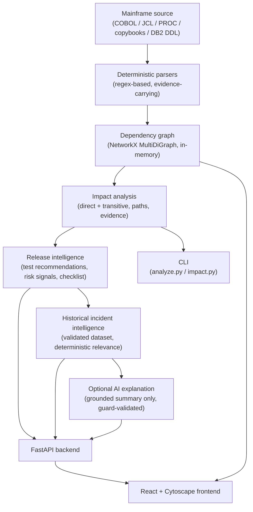
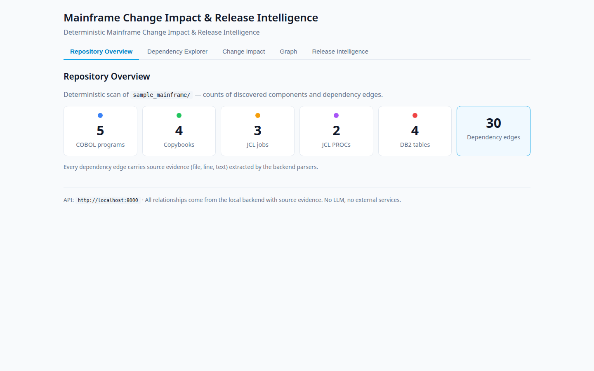
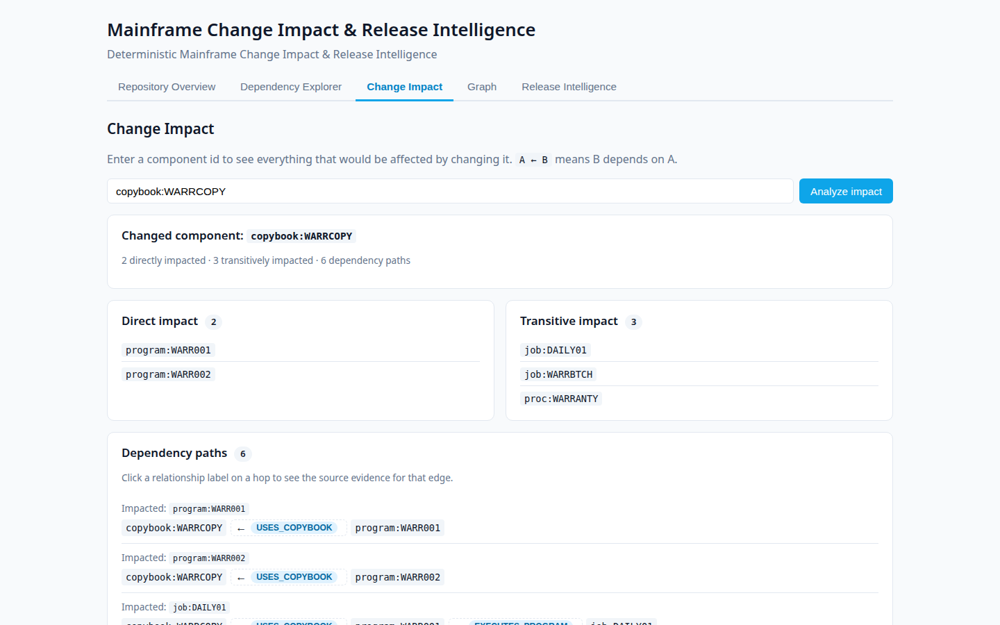
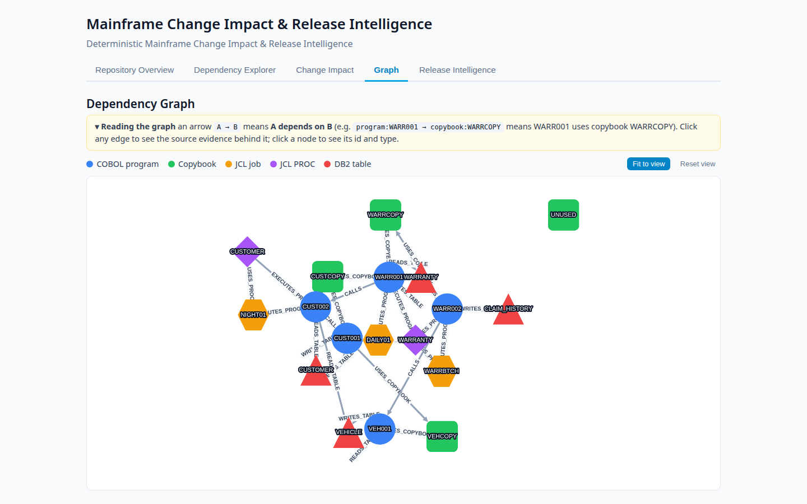
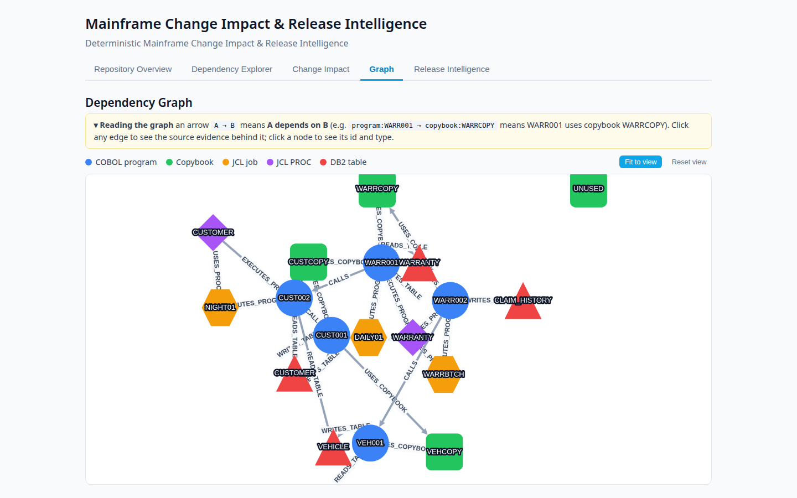
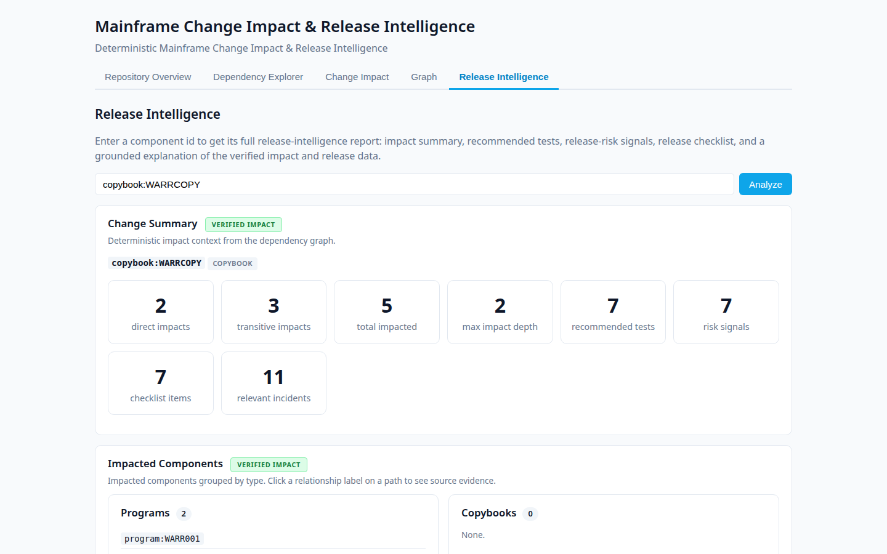
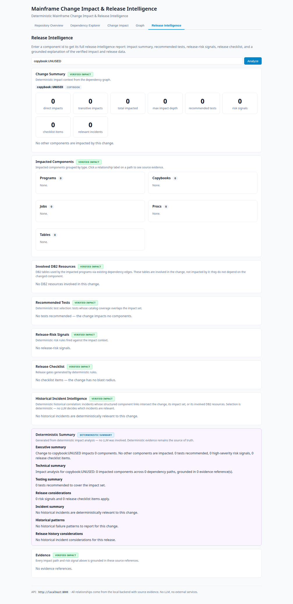

# Mainframe Change Impact & Release Intelligence

> **Deterministic-first design:** LLMs do not discover dependencies, calculate technical impact,
> select regression tests, create risk signals, select incidents, or modify verified deterministic
> results. AI is optional and is restricted to grounded explanation.

Answer *"what does changing this mainframe component affect?"* — from dependency discovery
through release readiness — with **verified, evidence-backed, deterministic analysis** and
historical incident intelligence.

## What it is

A full-stack platform that scans mainframe source (COBOL, copybooks, JCL, PROCs, DB2 DDL),
builds an evidence-carrying dependency graph, and answers change-impact questions:

- Which programs, jobs, and procedures depend on the changed component (directly and transitively)?
- Which DB2 tables are *involved* (read/written by impacted programs) — kept strictly distinct from *impacted* components?
- Which regression tests must run, and why (deterministic rule, with rationale and evidence per test)?
- What release risks does the change carry, and what should the release checklist cover?
- Which past incidents are deterministically related to this change — with historical severity kept separate from change relevance?
- Optionally: a grounded plain-language explanation of all of the above.

Three interfaces serve the same deterministic engine: a **CLI**, a **FastAPI backend**, and a
**React + Cytoscape frontend** with an interactive dependency graph and a Release Intelligence view.

## Why it exists

Mainframe estates are large, old, and poorly documented. A one-line change to a copybook can ripple
through batch jobs and DB2 writes in ways no one can hold in their head — and "just ask the LLM"
is not an acceptable analysis strategy for production releases, because LLMs invent facts.

### Problem statement

Change-impact analysis for mainframe systems must be **trustworthy**: every claimed relationship
must be traceable to a real source statement, and no step of the analysis may hallucinate. At the
same time, release teams need *actionable* output — test selection, risk signals, checklists,
historical precedent — not a raw edge list. This project proves both can coexist: a
deterministic core that never guesses, with an optional AI layer that is architecturally
incapable of altering the core's results.

## Capabilities

| Capability | How |
|---|---|
| **Deterministic dependency discovery** | Regex-based COBOL/JCL/DB2 parsers extract relationships; every dependency cites file, line, and exact source statement |
| **Change impact analysis** | Direct + transitive dependents via reverse graph traversal, with dependency paths and per-edge evidence |
| **Involved DB2 resources** | Tables read/written by impacted programs, derived from deterministic graph edges — explicitly "involved, not impacted" |
| **Regression test recommendation** | Deterministic rule: a test is recommended iff its coverage intersects the impact set; `MUST_RUN` / `SHOULD_RUN` levels with generated rationale and evidence |
| **Release risk signals** | 8 deterministic rules (e.g. `DB2_WRITE_INVOLVED` — the only `high` severity) with reasons and evidence |
| **Release checklist** | 7 deterministic items per change scenario, each citing its triggering rule |
| **Historical incident intelligence** | 17 synthetic incidents, deterministically matched by 5 reason types; severity separate from relevance |
| **Grounded AI explanation (optional)** | An LLM may *summarise* the deterministic results; output is guard-validated and can never alter them |
| **Interactive dependency graph** | Cytoscape graph with parallel-edge separation, Fit/Reset view, clickable evidence panel |
| **Negative control** | `copybook:UNUSED` demonstrates the engine reporting a clean zero-result instead of inventing relationships |

## Architecture



**Data-flow narrative** (see `docs/PROCESS_FLOW.md` for the full version):

1. `repository_scanner` walks `sample_mainframe/`, dispatching per file type to the COBOL, JCL, PROC, and SQL parsers.
2. Parsers emit components (18) and dependencies (30); each dependency carries mandatory evidence `{file, line, text}`.
3. The `DependencyGraph` (NetworkX `MultiDiGraph`) stores edges in **"depends on"** direction, preserving parallel edges (e.g. a program that both reads and writes a table).
4. `ImpactAnalyzer` traverses the **reversed** graph: dependents of the changed component are impacted (direct = distance 1, transitive = distance ≥ 2), producing shortest dependency paths with per-edge evidence.
5. `build_impact_context` + deterministic rules produce test recommendations, risk signals, and checklist items.
6. The incident relevance engine matches the validated 17-incident dataset against the impact context using 5 deterministic reason types.
7. Optionally, the AI layer serialises the deterministic results into a strict context, generates a four-section explanation, and the hallucination guard validates every identifier before the text can reach a user.

## The deterministic principle (read this first)

```
LLMs do not discover dependencies, calculate technical impact,
select regression tests, create risk signals, select incidents,
or modify verified deterministic results.

AI is optional and is restricted to grounded explanation.
```

The AI layer receives a **one-way serialised context of already-computed deterministic results** —
no repository paths, no raw source, no graph access. Its output is mechanically validated by a
hallucination guard (subject check + identifier-vocabulary check) and the UI badge is set
authoritatively by the service (`DETERMINISTIC SUMMARY` vs `AI EXPLANATION`), never parsed from
the text. On any failure — network error, bad key, guard rejection — the system falls back to
the deterministic provider. Full contract in `docs/AI_GROUNDING.md`.

## Example: change to `copybook:WARRCOPY`

The canonical demo scenario. Change the shared warranty copybook and the engine reports:

| Result | Value |
|---|---|
| Direct impacts | 2 — `program:WARR001`, `program:WARR002` |
| Transitive impacts | 3 — `job:DAILY01`, `job:WARRBTCH`, `proc:WARRANTY` |
| Dependency paths | 6 (shortest impact chains, each with per-edge evidence) |
| Recommended tests | 7 (6 `MUST_RUN`, 1 `SHOULD_RUN`) with rationale + evidence, e.g. `cobol/WARR001.cbl:15` — `COPY WARRCOPY.` |
| Risk signals | 7, including `DB2_WRITE_INVOLVED` (high) and `SHARED_COPYBOOK_CHANGE` |
| Release checklist | 7 items, each citing its triggering rule |
| Relevant historical incidents | 11 of 17, each with a deterministic reason (changed / direct / transitive / involved-write / involved-read) |

Try it:

```bash
.venv/bin/python impact.py copybook:WARRCOPY
curl http://127.0.0.1:8000/api/intelligence/copybook:WARRCOPY | python -m json.tool | head -40
```

## Negative control: `copybook:UNUSED`

`copybook:UNUSED` exists in the repository but nothing depends on it. The engine reports a clean
zero-result — 0 impacts, 0 tests, 0 signals, 0 incidents — instead of pretending everything is
related. A negative control is a first-class demo asset: it proves the engine derives
relationships from evidence rather than guessing.

```bash
.venv/bin/python impact.py copybook:UNUSED
```

## Screenshots


*Repository Overview — deterministic scan counts: 5 COBOL programs, 4 copybooks, 3 JCL jobs, 2 PROCs, 4 DB2 tables, 30 dependency edges.*


*Change Impact for `copybook:WARRCOPY` — direct and transitive impacts with dependency paths and source evidence.*


*Interactive Cytoscape dependency graph — parallel edges preserved, Fit to view / Reset view controls, clickable evidence panel.*


*Graph detail — the parallel `READS_TABLE` / `WRITES_TABLE` relationships between `WARR001` and `WARRANTY` render as independently selectable curves.*


*Release Intelligence — deterministic test recommendations, risk signals, checklist, and historical incident intelligence with trust-boundary badges.*


*Negative control — `copybook:UNUSED` produces a clean zero-result.*

## Technology stack

| Layer | Technology |
|---|---|
| Backend | Python 3.12, FastAPI, Pydantic v2, NetworkX (MultiDiGraph), PyYAML, uvicorn |
| AI layer | Provider ABC (`deterministic` default / `fake` for tests / `http` chat-completions client), regex hallucination guard |
| Frontend | React, TypeScript, Vite, Cytoscape.js (COSE layout), Vitest |
| Data | YAML incident dataset, YAML test catalog, synthetic `sample_mainframe/` repository |
| CI | GitHub Actions — backend pytest + frontend Vitest + production build |

## Repository structure

```
├── analyze.py / impact.py        # CLI: repository scan and change-impact queries
├── backend/
│   ├── parsers/                  # COBOL, JCL, PROC, SQL parsers + repository scanner (frozen)
│   ├── graph/                    # NetworkX MultiDiGraph wrapper + impact analyzer (frozen)
│   ├── models/                   # Component, Dependency, Evidence dataclasses
│   ├── intelligence/             # ImpactContext, test selector, risk signals, checklist,
│   │   ├── ai/                   #   incidents/, and the optional AI explanation layer
│   ├── api/                      # FastAPI app: /api/* (graph) + /api/intelligence/* etc.
│   └── tests/                    # 166 backend tests
├── frontend/src/
│   ├── views/                    # Overview, Dependency Explorer, Change Impact, Graph, Release Intelligence
│   └── __tests__/ / views/__tests__/   # 17 frontend tests (Vitest)
├── sample_mainframe/             # synthetic demo repository (COBOL, copybooks, JCL, PROCs, DB2 DDL,
│                                 #   incidents, test catalog) — see "Synthetic data" below
├── screenshots/                  # UI captures used in this README and docs/DEMO_GUIDE.md
├── docs/                         # public documentation (see "Documentation" below)
├── docs/archive/                 # phase working notes (historical)
├── .github/workflows/ci.yml      # CI: backend + frontend tests and build
├── INTERVIEW_READY_BASELINE.md   # frozen interview-ready baseline record
└── PHASE1/2A/2B/AUDITED_PRODUCT_BASELINE.md  # frozen phase records
```

## Synthetic data

**All mainframe source, test cases, and historical incidents in `sample_mainframe/` are synthetic
demonstration data.** They were authored for this project to exercise the engine and contain no
employer or client production code or data. Incident narratives, SQLCODEs, abends, and dates are
invented. This makes the repository safe to publish, demo, and discuss publicly.

## Prerequisites

- Python 3.12 (backend)
- Node.js 18+ and npm (frontend)
- A Chromium-based browser for the interactive graph (any modern browser works)

## Quick start

```bash
# 1. Clone and enter
git clone https://github.com/abhiClone/mainframe-change-impact-intelligence.git && cd mainframe-impact

# 2. Backend: create venv, install, run tests
python3.12 -m venv .venv
.venv/bin/pip install -r requirements.txt
.venv/bin/python -m pytest backend/tests/ -q        # 166 passed

# 3. Start the API
./run_api.sh                                         # http://127.0.0.1:8000

# 4. Frontend: install, test, run (new terminal)
cd frontend
npm ci
npm test                                             # 17 passed
npm run dev                                          # http://localhost:5173
```

Open http://localhost:5173, go to **Release Intelligence**, and analyse `copybook:WARRCOPY`.
Full setup details: `docs/SETUP.md`. Demo script: `docs/DEMO_GUIDE.md`.

## Backend setup

```bash
python3.12 -m venv .venv
.venv/bin/pip install -r requirements.txt
./run_api.sh
```

The API builds the dependency graph once at startup from `sample_mainframe/`. Optional LLM
explanation is configured via environment variables (see `.env.example`); the default
`INTELLIGENCE_PROVIDER=deterministic` needs no credentials and no network.

## Frontend setup

```bash
cd frontend
npm ci          # or: npm install
npm test        # Vitest, 17 tests
npm run build   # tsc + vite production build
npm run dev     # Vite dev server on :5173 (calls the API directly)
```

The frontend expects the API at `http://localhost:8000`.

## Running tests

```bash
./run_tests.sh                        # backend: 166 tests
cd frontend && npm test               # frontend: 17 tests
```

Coverage: parsers and robustness, graph multi-edge semantics, impact direction, evidence
completeness, deterministic test selection, risk-signal rules, checklist rules, incident
validation + relevance, AI guard + providers + fallback, API contracts, UI trust boundaries
(`VERIFIED IMPACT` / `DETERMINISTIC SUMMARY` / `AI EXPLANATION` badges), parallel-edge
independence, graph controls. See `docs/TESTING.md`.

## CLI commands

```bash
.venv/bin/python analyze.py sample_mainframe     # scan: 18 components, 30 dependencies
.venv/bin/python impact.py copybook:WARRCOPY     # full impact report (2 direct, 3 transitive, 6 paths)
.venv/bin/python impact.py copybook:UNUSED       # negative control: zero result
.venv/bin/python impact.py program:WARR001       # impact of a program change
.venv/bin/python impact.py table:WARRANTY        # impact of a DB2 table change
.venv/bin/python impact.py program:NOPE          # unknown component -> clear error
```

## API overview

Base URL `http://127.0.0.1:8000`. Unknown component ids return HTTP 404; a corrupted
incident dataset returns HTTP 500 naming the problem. Full reference: `docs/API.md`.

| Endpoint | Returns |
|---|---|
| `GET /api/summary` | repository counts (components, dependencies) |
| `GET /api/components` | all 18 components |
| `GET /api/dependencies` | all 30 dependencies with evidence |
| `GET /api/graph` | nodes + edges for the UI |
| `GET /api/component/{id}` | one component with upstream/downstream |
| `GET /api/impact/{id}` | direct + transitive impacts, dependency paths, evidence |
| `GET /api/intelligence/{id}` | full bundle: impact context, involved resources, test recommendations, risk signals, checklist, incident intelligence, explanation |
| `GET /api/test-recommendations/{id}` | recommended tests only |
| `GET /api/risk-signals/{id}` | risk signals only |
| `GET /api/test-catalog` | the 12-test catalog |
| `GET /api/incidents` | all 17 historical incidents |
| `GET /api/incidents/{incident_id}` | one incident |
| `GET /api/incident-intelligence/{id}` | relevant incidents with deterministic reasons |

## AI trust boundary

The UI makes the provenance of every explanation visible:

- **`VERIFIED IMPACT`** — deterministic results computed from the dependency graph.
- **`DETERMINISTIC SUMMARY`** — shown when no LLM produced the explanation (default provider or AI-unavailable fallback).
- **`AI EXPLANATION`** — shown only for validated LLM output.
- Historical incident **severity** is rendered separately from change **relevance** — a critical past incident is never presented as "this change is high risk".
- **Involved** DB2 resources are explicitly distinguished from **impacted** components ("involved in the change, not impacted by it").

The Evidence Panel carries the parser/no-inference message: relationships come from source
parsing, not from AI. Details: `docs/AI_GROUNDING.md`, `docs/EVIDENCE_MODEL.md`.

## Test status

| Suite | Result |
|---|---|
| Backend (`pytest backend/tests/`) | **166 passed, 0 failed** |
| Frontend (`npm test`, Vitest) | **17 passed, 0 failed** |
| Production build (`npm run build`) | ✅ tsc + vite succeed (non-blocking Cytoscape chunk-size warning) |
| Browser verification | Real Chromium at 1440×900, 1280×800, 900×800 — graph render, zoom/pan, Fit/Reset, evidence panel, parallel-edge click, intelligence view, empty states |

## Limitations

- Regex-based COBOL/JCL parsing; dynamic COBOL `CALL`s are not resolved; only Phase 1 dependency types supported (no CICS/IMS/MQ).
- Involved resources focus on DB2 `READ`/`WRITE` relationships; shortest impact paths only.
- In-memory NetworkX graph (per process); 17 synthetic incidents, no semantic incident similarity.
- HTTP LLM provider not live-tested with a paid API; AI prose is non-authoritative and not fully fact-checked.
- COSE node positions may vary between page loads; dense at 900px width.
- Full list: `docs/LIMITATIONS.md`.

## Roadmap

Frozen phases: Phase 1 (dependency engine) → Phase 2A (release intelligence + grounded AI) →
Phase 2B (incident intelligence) → audit remediation → interview-ready UX baseline.
Future candidates (not started): grammar-based COBOL parsing, CICS/IMS/MQ dependencies,
persistent graph backend, real incident-source integrations, live LLM provider testing.
Explicitly out of scope: automated release verdicts, failure-probability prediction, and any
design where an LLM discovers dependencies or modifies deterministic results.
See `ROADMAP.md`.

## Documentation

| Document | Contents |
|---|---|
| `docs/ARCHITECTURE.md` | Layered architecture, modules, design decisions |
| `docs/HOW_IT_WORKS.md` | End-to-end walkthrough of a change |
| `docs/PROCESS_FLOW.md` | Process flow with diagrams |
| `docs/SETUP.md` | Detailed backend/frontend setup |
| `docs/DEPENDENCY_MODEL.md` | Component and dependency model, evidence contract |
| `docs/CHANGE_IMPACT.md` | Impact semantics, direction, WARRCOPY/UNUSED scenarios |
| `docs/RELEASE_INTELLIGENCE.md` | Impact context, risk signals, release checklist |
| `docs/TEST_RECOMMENDATION.md` | Catalog schema, selection rule, MUST/SHOULD levels |
| `docs/INCIDENT_INTELLIGENCE.md` | Incident dataset, relevance engine, severity ≠ relevance |
| `docs/AI_GROUNDING.md` | AI contract, provider model, hallucination guard |
| `docs/EVIDENCE_MODEL.md` | Evidence model and the UI evidence panel |
| `docs/API.md` | Full API reference |
| `docs/TESTING.md` | Test suites and what they pin |
| `docs/DEMO_GUIDE.md` | Interview/demo script with screenshots |
| `docs/LIMITATIONS.md` | Known limitations |
| `docs/DESIGN_DECISIONS.md` | Key decisions and why |
| `docs/SECURITY_AND_PRIVACY.md` | Security posture, synthetic-data policy |
| `docs/archive/` | Phase working notes (historical) |
| `CHANGELOG.md` | Change history per baseline |
| `INTERVIEW_READY_BASELINE.md` | Frozen baseline: counts, guarantees, verification |

## License

MIT — see `LICENSE`.
