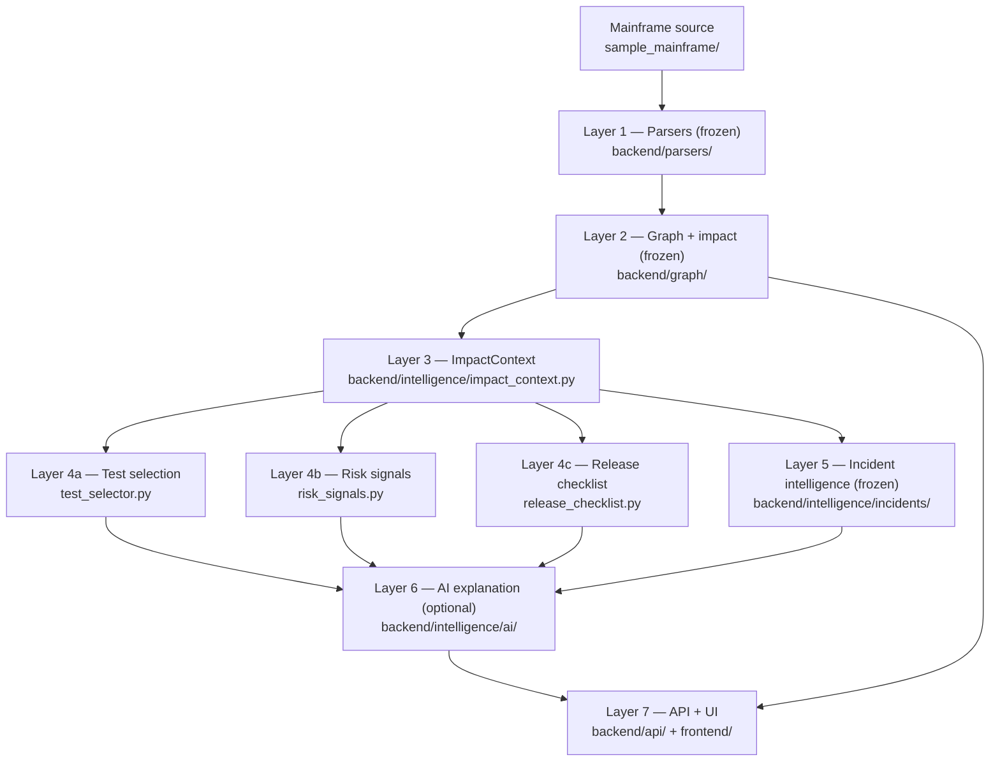

# Architecture

A layered, deterministic-first architecture. Each layer is a pure function over the output of
the layer below; the optional AI layer sits on top and cannot write back into any layer.



## Layers and ownership

| Layer | Module | Owns | Forbidden to do |
|---|---|---|---|
| 1. Parsers (frozen) | `backend/parsers/` | Components + dependencies extracted from source, with file:line:statement evidence | Change (frozen baseline) |
| 2. Graph + analyzer (frozen) | `backend/graph/` | NetworkX `MultiDiGraph`; reverse-traversal impact analysis (`analyze()`) | Change (frozen baseline) |
| 3. ImpactContext | `backend/intelligence/impact_context.py` | Typed, serializable translation of `analyze()` output; impact classification; involved DB2 resources from impacted programs' outgoing edges | Change impact traversal; LLM calls; new parsing |
| 4a. Test selection | `test_selector.py` | Coverage ∩ impact-set rule; `MUST_RUN`/`SHOULD_RUN`; rationale generation | Inventing tests |
| 4b. Risk signals | `risk_signals.py` | Rule-based signal detection; severities; explanations | Failure probabilities |
| 4c. Release checklist | `release_checklist.py` | Rule-based items, each citing its originating rule | Uncited items; release verdicts |
| 5. Incident intelligence | `incidents/` | Validated YAML dataset; deterministic relevance engine (5 reason types) | Modifying any Phase 1/2A result |
| 6. AI explanation (optional) | `ai/` | Four-section plain-language summary; provider abstraction; hallucination guard; deterministic fallback | Introducing any identifier not in the context (mechanically enforced) |
| 7. API / UI | `backend/api/`, `frontend/` | Serving and rendering the bundle | Owning computation that belongs to lower layers |

## Module reference

| Module | Responsibility |
|---|---|
| `backend/models/component.py` | `Component` dataclass: `id` (`"<kind>:<NAME>"`), `name`, `type`, `source_file` |
| `backend/models/dependency.py` | `Dependency` dataclass: `source`, `target`, `relationship`, mandatory `Evidence{file, line, text}` |
| `backend/parsers/cobol_parser.py` | `COPY` / static `CALL` / `EXEC SQL` (SELECT→read, INSERT/UPDATE/DELETE→write) extraction; regex-based, swappable internals |
| `backend/parsers/jcl_parser.py` | JCL `EXEC PGM=` / `EXEC PROC=` steps; `//*` comments skipped |
| `backend/parsers/sql_parser.py` | `CREATE TABLE` → DB2_TABLE components |
| `backend/parsers/repository_scanner.py` | Walks the repo, dispatches per file type; materializes unseen references as `source_file="unknown"` (explicit, never guessed) |
| `backend/graph/dependency_graph.py` | NetworkX `MultiDiGraph` wrapper; upstream/downstream/edge queries |
| `backend/graph/impact_analyzer.py` | BFS on the reversed graph; direct = distance 1, transitive = distance ≥ 2; shortest paths with per-edge evidence |
| `backend/api/app.py` | FastAPI app; graph built once at startup |
| `backend/api/intelligence.py` | Phase 2A/2B router: `/api/intelligence/{id}`, tests, signals, catalog, incidents |
| `backend/intelligence/ai/` | `ai_models` (strict contract) → `providers` → `guard` → `service.explain_change()` |
| `backend/changeset/` | `models` (change-set result contract) → `mapping` (file→component) → `providers` (explicit list / git diff) → `service` (multi-root aggregation over the frozen layers) → `ai` (change-set explainer + extended guard) |
| `backend/github/` (Phase 3B, unreleased) | Read-only GitHub PR change-source adapter → feeds the frozen Phase 3A analyzer. `errors` (typed, secret-free) → `models` (incl. pinned `GITHUB_API_VERSION`) → `client` (read-only REST, manual redirect handling) → `snapshots` (pre-scan + containment + size limits) → `provider` (status translation, source-root scope, rename boundaries) → `service` (orchestration). No GitHub-specific impact engine exists. |

## Key design decisions (summary)

- **Edge direction = "depends on".** `program:WARR001 --USES_COPYBOOK--> copybook:WARRCOPY` means WARR001 depends on WARRCOPY; impact traversal walks the reversed graph. Tested explicitly.
- **MultiDiGraph, not DiGraph.** A plain DiGraph collapses parallel relationships; MultiDiGraph keeps every dependency as its own edge with its own evidence (e.g. independent `READS_TABLE` + `WRITES_TABLE` edges).
- **Shortest paths only.** Each impacted component is reported via its shortest impact chain(s); parallel edges each get their own path variant.
- **No guessing.** Dynamic CALLs ignored; unknown references materialized explicitly, never invented.
- **Swappable graph backend.** All graph access goes through `DependencyGraph`; replacing NetworkX later means changing one module.

Full rationale: `docs/DESIGN_DECISIONS.md`. Phase working notes: `docs/archive/`.

## Phase 3B adapter (unreleased, branch `phase3b-github-pr-analysis`)

GitHub is a **change-source adapter**, not a new analysis layer:

```
GitHub PR metadata/files
  → exact base/head SHA snapshots
  → secure temporary extraction
  → GitHubPullRequestProvider (a Phase 3A ChangeSetProvider)
  → frozen ChangeSetAnalyzer
  → embedded ChangeSetIntelligence (+ optional grounded explanation)
```

- **No GitHub-specific impact engine exists.** Phase 3A is reused verbatim;
  the strongest invariant is release-blocking tested: a GitHub PR resolving
  to the same change set as Phase 3A explicit input, with equivalent
  snapshots, yields semantically identical `ChangeSetIntelligence`.
- `backend/api/github.py` serves `POST /api/github/pull-request/analyze` and
  `GET /api/github/status` (the latter exposes only `auth_configured`).
- `github_pr.py` is the CLI; the seventh frontend view (**GitHub PR**) reuses
  the shared `ChangeSetResults` component.
- Full detail: `docs/GITHUB_PR_ANALYSIS.md`.
