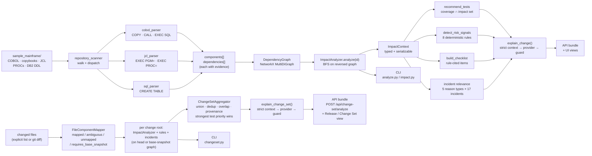
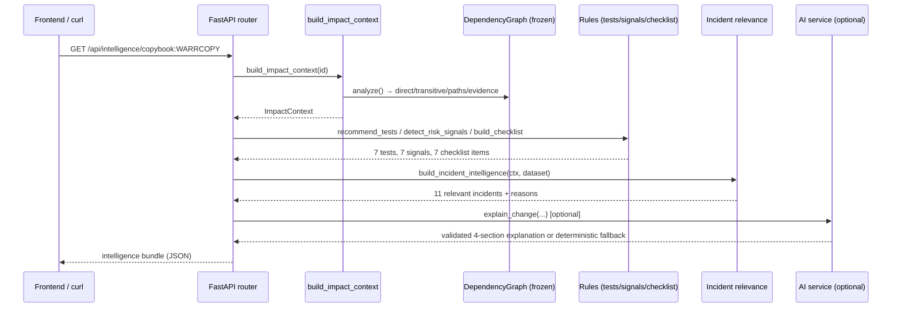
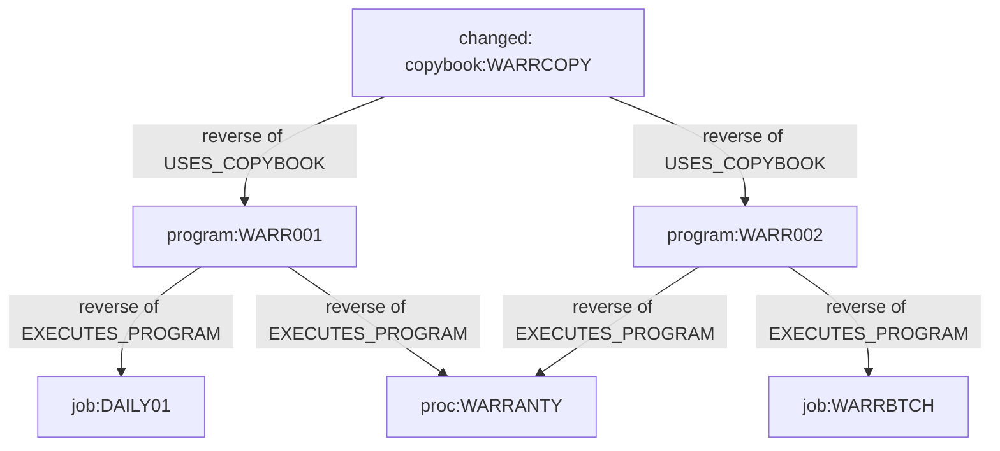

# Process Flow

## Full pipeline (source → intelligence)



## Request flow: `GET /api/intelligence/copybook:WARRCOPY`



## Request flow: `POST /api/github/pull-request/analyze` (Phase 3B, released in v1.2.0)

```mermaid
sequenceDiagram
    participant UI as Frontend / CLI
    participant API as FastAPI router
    participant GH as GitHubClient (read-only REST)
    participant SNAP as snapshots (secure temp extraction)
    participant P as GitHubPullRequestProvider
    participant A as ChangeSetAnalyzer (frozen Phase 3A)

    UI->>API: POST /api/github/pull-request/analyze {owner, repo, pull_number, source_root}
    API->>API: validate owner/repo/number/source_root (422 / 400 on bad input)
    API->>GH: GET PR metadata (exact base.sha / head.sha)
    API->>GH: GET changed files (paginated; >3000 → incomplete_change_set)
    GH-->>API: metadata + files
    API->>GH: GET tarball(base.sha) from base repo; GET tarball(head.sha) from head repo
    GH-->>SNAP: archives (manual 302 handling; approved-host check; no token forwarded)
    SNAP-->>API: extracted base/head trees (pre-scan + size guards; unsafe → unsafe_archive)
    API->>P: build provider (status translation, source_root scope, rename boundaries)
    P->>A: analyze() on head/base snapshots
    A-->>API: ChangeSetIntelligence (embedded intact)
    API-->>UI: GitHubPullRequestAnalysis (metadata + files + snapshots + intelligence)
```

## Impact traversal detail



Edges in the graph point **dependent → dependency** ("depends on"); impact walks them
backwards. Direct = distance 1, transitive = distance ≥ 2.

## Failure and edge behaviour

| Situation | Behaviour |
|---|---|
| Unknown component id | CLI: clear error · API: HTTP 404 |
| Component with no dependents (`copybook:UNUSED`) | Empty impact sets, empty paths, empty evidence — a valid zero result |
| Ambiguous change-set file, no resolution | Candidates surfaced; nothing auto-selected; no impact contributed |
| Unmapped change-set file (e.g. `README.md`) | Stays visible; contributes no Mainframe impact |
| Deleted change-set file, no base snapshot | `requires_base_snapshot`; uncertainty reported, no impact guessed |
| Invalid change-set resolution | CLI: clear error · API: HTTP 400 |
| Malformed `incidents.yaml` / `test_catalog.yaml` | Controlled domain error (HTTP 500 naming the problem), never a traceback |
| LLM provider misconfigured / unreachable / guard rejection | Deterministic fallback explanation; deterministic results unaffected |
| Unknown `INTELLIGENCE_PROVIDER` value | Silently falls back to `deterministic` |
| GitHub PR with > 3000 changed files (Phase 3B) | `incomplete_change_set` (HTTP 422): no impact computed from a partial list |
| Private repo without `GITHUB_TOKEN` / unknown repo or PR (Phase 3B) | `repository_not_found_or_not_authorized` / `pull_request_not_found` (HTTP 404): not-found and no-access are indistinguishable by design |
| GitHub rate limit hit (Phase 3B) | `github_rate_limited` (HTTP 429) with reset time; never retried in this phase |
| Unsafe archive member / snapshot size limit exceeded (Phase 3B) | `unsafe_archive` (HTTP 422) / `snapshot_too_large` (HTTP 413): archives are never silently truncated |
| PR file outside `source_root` (Phase 3B) | Stays visible (`outside_source_scope`); contributes no Mainframe impact |
| Unknown GitHub file status (Phase 3B) | `unsupported_github_status` (HTTP 422): never silently converted |
| Deleted-fork PR with unreachable head SHA (Phase 3B) | `head_snapshot_unavailable` (HTTP 422) |
