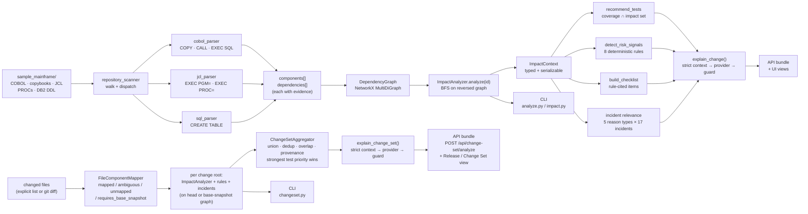
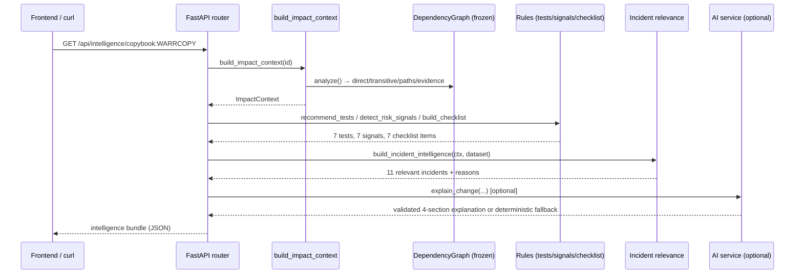
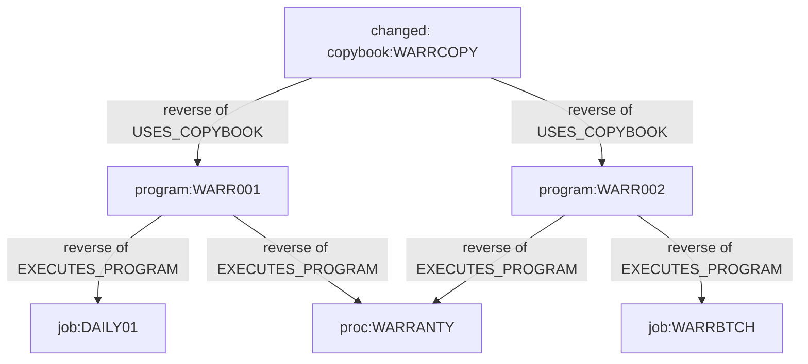

# Process Flow

## Full pipeline (source → intelligence)

## Request flow: `GET /api/intelligence/copybook:WARRCOPY`

## Impact traversal detail

Edges in the graph point **dependent → dependency** ("depends on"); impact walks them
backwards. Direct = distance 1, transitive = distance ≥ 2.

## Failure and edge behaviour

| Situation | Behaviour |
|---|---|
| Unknown component id | CLI: clear error · API: HTTP 404 |
| Component with no dependents (`copybook:UNUSED`) | Empty impact sets, empty paths, empty evidence — a valid zero result |
| Ambiguous change-set file, no resolution | Candidates surfaced; nothing auto-selected; no impact contributed |
| Unmapped change-set file (e.g. `README.md`) | Stays visible; contributes no Mainframe impact |
| Deleted change-set file, no base snapshot | `requires_base_snapshot`; uncertainty reported, no impact guessed |
| Invalid change-set resolution | CLI: clear error · API: HTTP 400 |
| Malformed `incidents.yaml` / `test_catalog.yaml` | Controlled domain error (HTTP 500 naming the problem), never a traceback |
| LLM provider misconfigured / unreachable / guard rejection | Deterministic fallback explanation; deterministic results unaffected |
| Unknown `INTELLIGENCE_PROVIDER` value | Silently falls back to `deterministic` |
